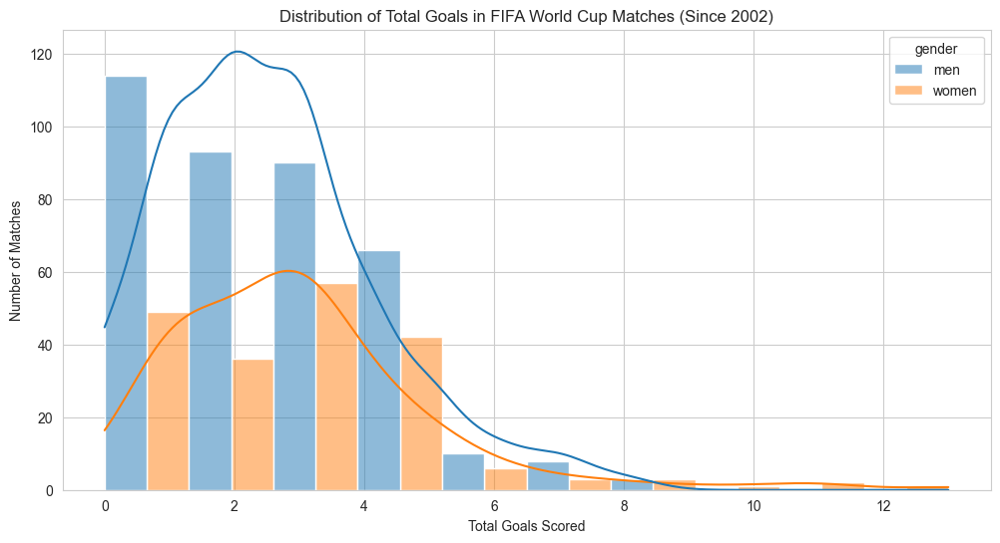

# Statistical Analysis of Goal-Scoring in Men's vs. Women's World Cups

This project conducts a statistical investigation to answer questions in the soccer world: **Are more goals scored in Women's FIFA World Cup matches than in Men's?**

It uses hypothesis testing with Python libraries like `pandas`, `scipy`, and `pingouin` to determine if the observed differences in goal-scoring are statistically significant or merely due to random chance.

## Key Findings: A Summary of Results

The analysis tested four distinct hypotheses using a **significance level (α) of 0.10**. The results provide a nuanced picture of the differences and similarities between the two tournaments.

| Hypothesis Tested                                      | P-Value | Significance Level (α) | Result                        |
| ------------------------------------------------------ | ------- | ---------------------- | ----------------------------- |
| 1. Mean **Total Goals** are greater in Women's matches   | 0.0051  | 0.10                   | **Reject Null Hypothesis** |
| 2. Proportion of **Draws** is different                | 0.0192  | 0.10                   | **Reject Null Hypothesis** |
| 3. Mean **Home Team Goals** are different              | 0.0148  | 0.10                   | **Reject Null Hypothesis** |
| 4. Mean **Away Team Goals** are greater in Women's matches | 0.6398  | 0.10                   | **Fail to Reject Null Hypothesis** |

## The Analytical Question: Is the Difference Statistically Significant?

Exploratory data analysis showed that the goal data is not normally distributed, which is why non-parametric tests were chosen.

To visualize the distribution of goals in both tournaments, see the plot below:



## Hypotheses for the Analysis

The project was structured around four precise hypotheses:

**1. Mean Total Goals:**

  - **$H_0$ (Null Hypothesis):** The mean total goals are the same in both tournaments.
  - **$H_a$ (Alternative Hypothesis):** The mean total goals are greater in the Women's World Cup.

**2. Frequency of Draws:**

  - **$H_0$ (Null Hypothesis):** The proportion of matches ending in a draw is the same for both tournaments.
  - **$H_a$ (Alternative Hypothesis):** The proportion of matches ending in a draw is different between the two tournaments.

**3. Mean Home Team Goals:**

  - **$H_0$ (Null Hypothesis):** The mean home goals scored is the same in both tournaments.
  - **$H_a$ (Alternative Hypothesis):** The mean home goals scored is different between the two tournaments.

**4. Mean Away Team Goals:**

  - **$H_0$ (Null Hypothesis):** The mean away goals scored is the same in both tournaments.
  - **$H_a$ (Alternative Hypothesis):** The mean away goals scored is greater in the Women's World Cup.

## Methodology and Statistical Toolkit

To ensure the analysis was robust, specific statistical tests were chosen based on the data type and distribution.

### Mann-Whitney U Test

  - **What it is:** A non-parametric test used to compare the distributions of two independent samples.
  - **Why it was chosen:** The exploratory data analysis (EDA) revealed that the goal-scoring data (`total_goals`, `home_score`, `away_score`) is not normally distributed (it is right-skewed). The Mann-Whitney U test is the appropriate choice in this scenario, as it does not assume normality, unlike its parametric counterpart, the t-test. It was used for Hypotheses 1, 3, and 4.

### Chi-Squared Test of Independence

  - **What it is:** A test used to determine if there is a significant association between two categorical variables.
  - **Why it was chosen:** Hypothesis 2 deals with match outcomes (e.g., "Draw," "Win"), which are categorical. The Chi-Squared test allows us to compare the proportions of these outcomes across the two gender categories to see if the distribution of outcomes is independent of the tournament type.

### Custom Interpretation Function

A general Python function was created to standardize the interpretation of the p-value against the significance level for each test, ensuring consistency and readability.
```python
def interpret_hypothesis_test(p_value, alt_description, alpha=0.1):
    """
    General function to interpret hypothesis test results.

    Parameters:
    - p_value (float): The p-value from the test result.
    - alt_description (str): What the alternative hypothesis claims.
    - alpha (float, optional): Significance level (default is 0.1).
    """
    
    print(f"Significance Level (alpha): {alpha}")
    print(f"P-value: {p_value:.4f}")

    if p_value < alpha:
        print("Result: Reject the null hypothesis (H₀).")
        print(f"Conclusion: There is significant evidence that {alt_description}.")
    else:
        print("Result: Fail to reject the null hypothesis (H₀).")
        print(f"Conclusion: There is not enough evidence to conclude that {alt_description}.")
```

## Dataset Description

This analysis uses two datasets containing the results of every official men's and women's international football match since the 19th century. The data was scraped from a reliable online source and stored in two CSV files:

* `men_results.csv`
* `women_results.csv`

For this project, the data was filtered to include **only official FIFA World Cup matches** (not including qualifiers) that occurred **since January 1, 2002**.

Each record contains the following columns: `date`, `home_team`, `away_team`, `home_score`, `away_score`, and `tournament`.

## Project Structure
```
soccer-hypothesis-testing/
│
├── assets/
│   ├── soccer-analysis-banner.png
│   └── goal-distribution.png
│
├── data/
│   ├── men_results.csv
│   └── women_results.csv
│
├── world_cup_goals_analysis.ipynb
│
└── README.md
```
